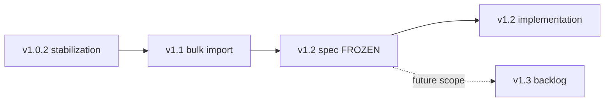
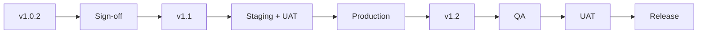
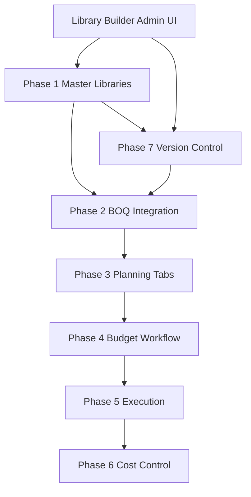
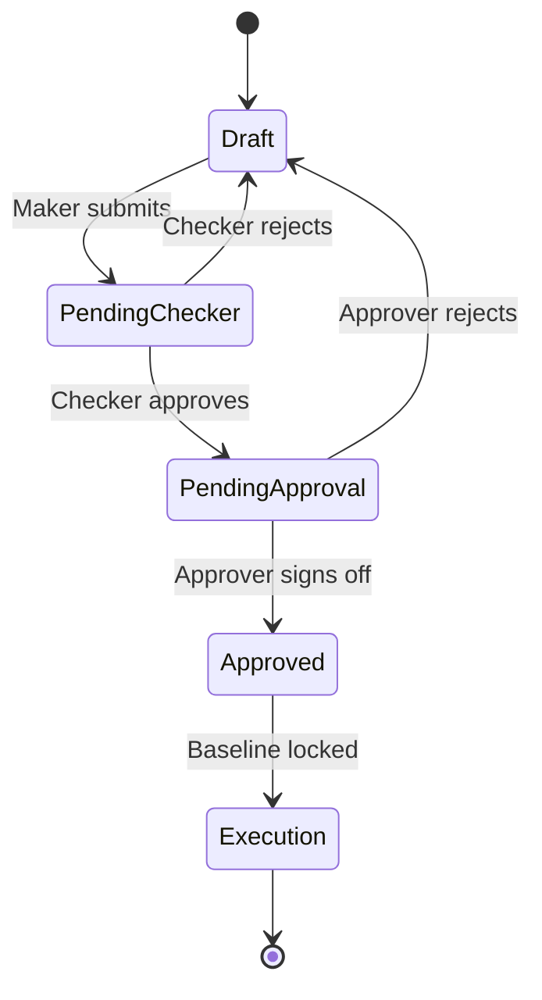
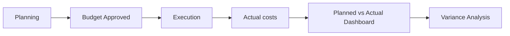

# Planning & Costing — v1.2 Architecture Specification

**Document owner:** MAXEK ERP product / engineering  
**Status:** APPROVED / FROZEN  
**Prior status:** READY FOR REVIEW → APPROVED / FROZEN (2026-06-29)  
**Last updated:** 2026-06-29  
**Production URL:** https://erp.maxekindia.com

This specification defines the **Planning & Costing** platform for **v1.2**: a version-controlled, BOQ-driven budgeting system that connects master libraries, multi-tab project planning, formal approval, execution actuals, and cost-control analytics. It supersedes the prior definition of v1.2 as “Phase 2 bulk import saves” in `docs/MAXEK_ERP_RELEASE_PLAN.md`; bulk import remains in **v1.1**, and v1.2 delivers the **complete planning platform**.

> **Specification freeze:** This document is **frozen** after commit on branch `release/v1.2-planning`. Do not amend v1.2 scope here. Future enhancements belong in [`docs/PLANNING_COSTING_V1_3_BACKLOG.md`](PLANNING_COSTING_V1_3_BACKLOG.md).


---

## Table of contents

0. [Design Freeze](#design-freeze)
1. [Release plan](#1-release-plan)
2. [Purpose and positioning](#2-purpose-and-positioning)
3. [Phased delivery roadmap](#3-phased-delivery-roadmap)
4. [Architecture guardrails](#4-architecture-guardrails)
5. [Project type (project creation)](#5-project-type-project-creation)
6. [Phase 1 — Master libraries](#6-phase-1--master-libraries)
7. [Phase 2 — BOQ integration](#7-phase-2--boq-integration)
8. [Phase 3 — Planning workspace (seven tabs)](#8-phase-3--planning-workspace-seven-tabs)
9. [Phase 4 — Budget workflow](#9-phase-4--budget-workflow)
10. [Phase 5 — Execution integration](#10-phase-5--execution-integration)
11. [Phase 6 — Cost control dashboard](#11-phase-6--cost-control-dashboard)
12. [Project Cost Control](#12-project-cost-control)
13. [Phase 7 — Version-controlled libraries](#12-phase-7--version-controlled-libraries)
14. [Library Builder (admin)](#13-library-builder-admin)
15. [End-to-end flow](#14-end-to-end-flow)
16. [Data model outline (high level)](#15-data-model-outline-high-level)
17. [Integration with existing modules](#16-integration-with-existing-modules)
18. [Relationship to current MVP](#17-relationship-to-current-mvp)
19. [Non-functional requirements](#18-non-functional-requirements)
20. [Out of scope for v1.2](#19-out-of-scope-for-v12)
21. [Related documents](#20-related-documents)

---

## Design Freeze

| Field | Value |
|-------|-------|
| **Version** | v1.2 |
| **Status** | APPROVED |

During v1.2 delivery the following are **frozen**:

- **No database redesign** — implement the data model in this spec; schema changes only when required to implement an approved requirement.
- **No workflow redesign** — maker → checker → approver and baseline lock behave as specified; no alternate approval models.
- **No planning screen redesign** — seven-tab planning workspace layout and tab responsibilities are fixed; polish and defect fixes only.
- **Implementation only** — engineering work must trace to sections in this document; no net-new product scope in v1.2.
- **Enhancements** — ideas beyond this spec go to [`docs/PLANNING_COSTING_V1_3_BACKLOG.md`](PLANNING_COSTING_V1_3_BACKLOG.md) for v1.3+ chartering.

### Overall release flow



---

## 1. Release plan

Releases are **sequential**. Each version must pass staging UAT before production deploy. Production stays pinned to the signed-off baseline until the next version is explicitly approved.

| Version | Purpose | In scope | Out of scope |
|---------|---------|----------|--------------|
| **v1.0.2** | Production stabilization | Critical/high defects from production UAT; broken CRUD; permission/security fixes; data integrity hotfixes; schema changes **only** when required to fix a verified defect | New modules, UI redesign, bulk import, planning & costing, feature requests |
| **v1.1** | Bulk import & migration | Core import framework, BOQ library, BOQ Excel import, materials import, migration wizard (per `docs/BULK_IMPORT_MIGRATION.md`), import audit; **populates WBS, Resource, Rate, and Productivity libraries** for v1.2 | Vendor/employee/COA/opening-balance **save** stubs; Planning & Costing UI |
| **v1.2** | Complete planning platform | Phases 1–7 below: master libraries, BOQ auto-load, seven-tab planning, maker→checker→approver lock, execution hooks, cost-control KPIs, versioned templates, Library Builder | Full treasury/reconciliation bulk save (deferred); native mobile field app; v2.0 predictive analytics |

### Release policy (unchanged)

```text
Development → Internal testing → Staging → UAT → Production → Git tag → Rollback point
```

### Version notes

- **v1.0.2** aligns with the maintenance-release intent of v1.0.1 in `docs/MAXEK_ERP_RELEASE_PLAN.md`; numbering reflects an additional stabilization pass after baseline sign-off.
- **v1.1** prerequisite: v1.0.x production stable and tagged. Delivers BOQ, materials, and **library seed data** (WBS, Resource, Rate, Productivity) that v1.2 planning consumes.
- **v1.2** prerequisite: v1.1 bulk import stable in production; libraries and BOQ import available for template seeding and project onboarding.

### Recommended development sequence

Releases and gates are **strictly sequential**. Do not start v1.2 feature branch until v1.1 is signed off in production.

### Final development order



*Active track:* v1.0.2 VPS UAT remains the current production stabilization path until v1.0.2 sign-off; v1.2 implementation starts only after v1.1 is in production.*

| Step | Gate | Outcome |
|------|------|---------|
| 1 | v1.0.2 defects closed | Stable production baseline |
| 2 | Staging UAT pass | Sign-off document approved |
| 3 | v1.1 import UAT | WBS / Resource / Rate / Productivity libraries populated from import |
| 4 | v1.2 phase UAT (§4.9) | Planning platform approved |
| 5 | Production deploy | Git tag + rollback point |

---

## 2. Purpose and positioning

Planning & Costing is the **enterprise budget engine** for construction and infrastructure projects. It transforms an approved **BOQ** into a **locked project budget** by applying a **versioned, project-type-specific WBS template**, rolling up **labour, machinery, material, subcontract, and indirect costs**, and publishing a **single baseline** for execution, procurement, payroll, billing, and variance analytics.

**Primary users:** Planners, estimators, project managers, approvers, cost controllers, company admins.  
**Business outcome:** One auditable, version-controlled budget baseline for DPR actuals, attendance, machinery logbook, MR/PR/PO, store issues, client billing, project costing, and accounts — with planned vs actual vs variance visibility at project, BOQ, activity, and cost-category level.

**Design principles**

- **Library-first:** Norms, rates, and templates are admin-maintained master data — not hardcoded application logic.
- **BOQ-driven:** Commercial quantities and work categories drive auto-load of WBS, resources, and productivity.
- **Workflow-governed:** Budget changes follow maker → checker → approver; approved baselines are read-only.
- **Execution-linked:** Actuals post against stable planning IDs, not name matching.
- **Version-aware:** WBS library copied to **Project WBS Snapshot** at planning open; master changes do not affect existing projects; replanning creates new baseline versions.

---

## 3. Phased delivery roadmap

v1.2 is delivered as **seven integrated phases**. Phases are sequenced for dependency order but may be developed in parallel streams where master data precedes transactional UI.

| Phase | Name | Deliverable |
|-------|------|-------------|
| **1** | Master libraries | Standard WBS, Productivity, Labour, Machinery, Material, Rate, Crew Composition, Equipment Productivity |
| **2** | BOQ integration | Project → BOQ → BOQ Item auto-loads template, activities, resources, productivity, rates, equipment, materials |
| **3** | Planning tabs | Seven-tab workspace: Activity, Labour, Machinery, Material, Subcontract, Schedule, Cost Summary |
| **4** | Budget workflow | Planner → Maker → Checker → Approver → Budget Locked → Execution; read-only after approval |
| **5** | Execution integration | DPR, attendance, machinery logbook, MR, PR, PO, store issues, billing, project costing, accounts |
| **6** | Cost control | Planned vs Actual vs Variance KPI dashboard |
| **7** | Version-controlled libraries | Template versions (e.g. Road v1.0 / v1.1); snapshot on project create |



---

## 4. Architecture guardrails

These rules are **non-negotiable** for v1.2 implementation. They prevent late redesign of tenancy, costing, versioning, and execution integration.

### 4.1 Multi-tenant isolation (planning tables)

Every **planning transactional table** and child line table carries the following scope columns. APIs must validate the full chain on read/write; missing or mismatched FKs reject the request.

| Column | Scope | Required on |
|--------|-------|-------------|
| `tenant_id` | Platform tenant (top-level isolation) | All library + planning tables |
| `customer_id` | Customer / subscriber within tenant | All library + planning tables |
| `company_id` | Operating company within customer | Planning baselines, child lines, execution FKs |
| `project_id` | Project | All planning child tables |
| `boq_id` | BOQ master | `planning_boq_lines`, BOQ-scoped resource lines |
| `boq_item_id` | BOQ line | Activity maps, labour/machinery/material/subcontract lines where BOQ-allocated |

**Library and template masters** require at minimum `tenant_id` + `customer_id`. No cross-tenant reads; platform **system seeds** are copied into tenant scope on onboarding, not shared live.

**Query rule:** Session resolves `tenant_id` and `customer_id`; filter every query. Never trust client-supplied tenant/customer id without session validation. `company_id` and `project_id` must belong to the same customer chain.

**Unique constraints** are per tenant (e.g. template code + version + `customer_id`).

### 4.2 Project type drives template catalog filter

- On planning open, the **template picker** lists only templates where `wbs_templates.project_type_id` matches `projects.project_type_id` (or universal templates with null project type).
- **CUSTOM** project type may list all active templates for the tenant plus blank-WBS option.
- Admin **Project types** screen maps default template version per type; auto-load uses this mapping unless planner overrides on first open (override audited).

### 4.3 Template snapshot — Project WBS Snapshot (immutable)

On **first planning open** for a baseline:

1. Resolve `template_id` + `template_version` from project type (or planner override).
2. **Physically copy** the WBS library tree into **`project_wbs_snapshot`** (and linked norm snapshot rows where required) — this is the **Project WBS Snapshot**, not a live pointer to master.
3. Persist `template_id`, `template_version`, and `project_wbs_snapshot_id` on `planning_baselines`.

**After snapshot:**

- **Master library changes do not affect existing projects.** Edits to `wbs_templates`, `wbs_template_nodes`, or norms in Library Builder apply only to **new** planning baselines.
- Draft **refresh-from-library** re-reads from the **snapshot version** bound to the baseline, not the latest published master.
- **Locked baselines:** snapshot rows are immutable; no in-place norm or node replacement.
- **Replan / amendment:** new `planning_baselines` row (v2, v3…) creates a **new** Project WBS Snapshot — never UPDATE-in-place on approved baseline or snapshot tables.

### 4.4 Rate library — effective dates and version

- Every rate row has `effective_from` (required) and `effective_to` (nullable = open-ended).
- **Resolution at planning time:** pick rate where `planning_date` (or project start date) ∈ [effective_from, effective_to], scoped by `tenant_id` + `customer_id`, resource type, and optional region/project override; tie-break by most specific scope then latest `effective_from`.
- **Overlapping rates** for same resource + scope are invalid at publish time (admin validation).
- Rate changes do **not** retroactively change locked baselines; draft refresh re-resolves from snapshot + rate effective on planning date.

**Example — labour rate for Mason (tenant-scoped):**

| resource_type | resource_code | rate | uom | effective_from | effective_to | scope |
|---------------|---------------|------|-----|----------------|--------------|-------|
| labour | MASON | 650.00 | day | 2025-04-01 | 2025-09-30 | customer default |
| labour | MASON | 720.00 | day | 2025-10-01 | NULL | customer default |
| labour | MASON | 780.00 | day | 2025-10-01 | NULL | project MA102 override |

- Project **MA102** with start date 2025-11-01 resolves **780.00** (project override wins over customer default).
- Project **MA105** with start date 2025-08-15 resolves **650.00** (only row covering that date).
- Locked baseline approved 2025-08-01 keeps **650.00** even if rates change later.

### 4.5 UOM consistency (BOQ → planning → execution)

- **BOQ unit** is the commercial quantity anchor. Activity productivity converts BOQ qty → activity qty using explicit conversion or same-UOM assumption.
- **Norm UOM** (per unit of BOQ or activity) must be defined on library rows; auto-load rejects or flags unmapped UOM mismatch.
- **Planning lines** store `uom` on labour, machinery, material, subcontract rows; Cost Summary rolls up only after UOM-normalized quantities.
- **Execution documents** (DPR, MR, store issue) store qty + UOM; variance compares in **common base UOM** per BOQ line (conversion table or master UOM on material/equipment).
- **Single UOM master** per tenant; no duplicate symbols (e.g. `m3` vs `cum`) without explicit alias mapping.

### 4.6 Cost engine — full calculation chain (never bypassed)

The cost engine runs this **complete pipeline** for every BOQ line and project rollup. Steps are **mandatory and ordered** — no shortcut paths, manual total entry, or skipped stages.

```text
BOQ qty
  → productivity norms        → planned activity qty
  → duration / schedule       → planned duration (feeds period phasing)
  → labour norms + rates      → labour cost
  → machinery norms + rates   → machinery cost
  → material norms + rates    → material cost
  → fuel norms                → fuel cost
  → transport rules           → transport cost
  → subcontract scopes        → subcontract cost
  → overhead rules            → overhead cost
  → contingency rules         → contingency cost
  → TOTAL COST                → sum of cost categories
  → unit cost                 → TOTAL COST ÷ BOQ qty
```

**Rollup order for Cost Summary display** (subtotals after each direct category):

```text
1. Labour
2. Machinery
3. Material
4. Fuel
5. Transport
6. Subcontract
7. Overhead      (% on direct subtotal through line 6)
8. Contingency   (% or lump on subtotal after overhead)

Total Cost = lines 1–8
Unit cost    = Total Cost ÷ BOQ quantity
Margin       = (BOQ Rate × BOQ Qty) − Total Cost   (where BOQ rate exists)
```

- **Productivity** must run before resource explosion; **duration** derives from activity qty and productivity or schedule tab.
- **Overhead and Contingency** are computed from rules — never typed as overrides of Total Cost.
- UI, API, and batch recalculation **must call the same engine**; no duplicate formulas in templates or reports.

### 4.7 Budget lock, amendments, and revision history (never overwrite)

- **Approved** baseline: all planning child rows, Project WBS Snapshot, and cost summary are **read-only** for planner/maker roles.
- **Locked after approval** — no PATCH of approved amounts, rates, quantities, or snapshot rows except Super Admin defect hotfix with mandatory audit.
- **Amendment workflow:** request change → create **new** `planning_baselines` row (`version + 1`, status `Draft`) → copy forward editable draft from prior version or fresh auto-load → maker → checker → approver → new **Approved** baseline.
- **`planning_baseline_revisions`** (or equivalent) stores revision history: `baseline_id`, `prior_baseline_id`, `revision_no`, `reason`, `requested_by`, `approved_at`, `approval_request_id`.
- **Never overwrite** approved baseline rows or snapshot data; historical versions remain queryable for audit and variance.
- **Execution actuals** stay tied to the baseline version under which they were posted; merging or replacing historical baselines is forbidden.
- `projects.active_planning_baseline_id` points to latest **approved** version only.

### 4.8 v1.1 bulk import → master libraries (import path)

**v1.1 bulk import populates master libraries** that v1.2 planning consumes. Import is the primary onboarding path for tenants migrating from spreadsheets or legacy ERP.

| Import target (v1.1) | Library / master populated | Used by v1.2 |
|----------------------|----------------------------|--------------|
| BOQ library / BOQ Excel | `boq_master`, `boq_items` (+ `work_category` when mapped) | Phase 2 auto-load, commercial qty anchor |
| WBS template import | **WBS library** (`wbs_templates`, `wbs_template_nodes`) | Project WBS Snapshot source |
| Resource import (labour, machinery, material) | **Resource libraries** (labour/machinery/material norms, crew) | Labour / Machinery / Material tabs |
| Rate import | **Rate library** (`rate_cards`) | Cost engine rate resolution |
| Productivity import | **Productivity library** (`productivity_norms`, equipment productivity) | BOQ qty → activity qty chain |
| Materials import | `materials` master | Material norms and Material Planning |

- **No duplicate master:** imported rows are referenced by FK from planning; planning does not embed copy-paste strings.
- **Tenant scope:** all imported library rows stamped with `tenant_id` + `customer_id`.
- v1.2 **Library Builder** provides CRUD on the same tables; import and UI share one schema.
- Vendor/employee/COA/opening-balance **save** remains out of v1.1 scope per release plan.

### 4.9 Acceptance criteria by phase

Sign-off requires all items checked for the phase in staging UAT.

#### Phase 1 — Master libraries

- [ ] All eight library types CRUD via Library Builder with `tenant_id` + `customer_id` scope
- [ ] Effective dating on rates and norms; overlapping rate validation on publish
- [ ] Clone template (e.g. Road v1.0 → Road v1.1) and activate/deactivate
- [ ] Audit columns (`created_by`, `modified_by`, timestamps) on all master rows
- [ ] Tenant A cannot read or edit Tenant B libraries (API + UI test)
- [ ] **Example:** Admin creates Road v1.0 template with 50 WBS nodes, labour norm on “Earthwork” node, rate card for JCB hourly — all visible only within customer scope

#### Phase 2 — BOQ integration

- [ ] Project type filters template catalog; CUSTOM shows all active templates
- [ ] Auto-load from BOQ + work category creates activities and resource rows
- [ ] **Project WBS Snapshot** created on first open; master edit does not change snapshot
- [ ] `template_id`, `template_version`, `project_wbs_snapshot_id` on baseline
- [ ] BOQ split % validates to 100% per line
- [ ] **Example:** BOQ line “Item 3.1 Earthwork 1000 cum” maps to WBS node Earthwork, explodes labour + machinery + material rows with rates resolved for project start date

#### Phase 3 — Planning tabs

- [ ] Seven tabs present, linked, and persist on save
- [ ] Cost Summary read-only; full engine chain (§4.6) with no manual total override
- [ ] UOM mismatch flagged before submit
- [ ] Subcontract and Schedule tabs included in rollup
- [ ] **Example:** Planner overrides mason hours on one activity with reason code; Cost Summary recalculates labour → total → unit cost automatically

#### Phase 4 — Budget workflow

- [ ] States: Draft → Pending Checker → Pending Approval → Approved / Rejected
- [ ] Approved locks all tabs and snapshot rows
- [ ] `approval_requests` linked to `planning_baselines.id`
- [ ] Amendment creates **new** baseline version + revision history row; prior version unchanged
- [ ] **Example:** Approver rejects with comment; maker edits draft and resubmits; on approve, `planning_locked_at` set and tabs read-only

#### Phase 5 — Execution integration

- [ ] DPR stores `planning_activity_id`, `planning_baseline_id`, `boq_item_id`, `project_id`, `company_id`
- [ ] MR/PR optional budget check against locked baseline
- [ ] Actuals tagged with baseline version; replan does not rewrite historical actuals
- [ ] Material, labour, machinery actual cost paths documented and testable
- [ ] **Example:** DPR for Activity A posts 80 cum actual; cost control shows qty and cost variance vs locked baseline v1

#### Phase 6 — Cost control

- [ ] Planned vs Actual vs Variance at project, BOQ, activity, category
- [ ] Drill-down to source documents (DPR, MR, PO)
- [ ] Export Excel/PDF; role-based visibility

#### Phase 7 — Version control

- [ ] Multiple template versions per family; one active for new projects
- [ ] Locked project retains Project WBS Snapshot from approval time
- [ ] Publish new master version does not alter existing project snapshots
- [ ] Version label + export minimum audit trail

### 4.10 Out of scope boundary (v1.2)

Reinforces [§19](#19-out-of-scope-for-v12). Implementation **must not** expand v1.2 branch scope into:

- Vendor/employee/COA/opening-balance bulk **save** (v1.1 stubs or later).
- Treasury, bank reconciliation, multi-currency planning.
- Native mobile field app, AI rate/BOQ, full CPM.
- Concurrent editable planning branches or merge of approved baselines.
- Retroactive template/rate push to locked baselines.

---

## 5. Project type (project creation)

On **Project Master** create (editable until planning is submitted for approval), the user selects **Project Type**. This drives which **WBS template** (and default library bundle) is offered when planning starts.

### Standard project types (system seed)

| Code | Label | Typical use |
|------|-------|-------------|
| `ROAD` | Road | Highways, pavements, earthwork |
| `BUILDING` | Building | Residential, commercial, institutional |
| `BRIDGE` | Bridge | RCC/steel bridges, culverts |
| `IRRIGATION` | Irrigation | Canals, dams, lift irrigation |
| `INDUSTRIAL` | Industrial | Plants, factories, warehouses |
| `INFRASTRUCTURE` | Infrastructure | Ports, airports, utilities, mixed civil |
| `CUSTOM` | Custom | User picks or assembles template manually |

### Behaviour

- **Template selection:** Default WBS library template = project type mapping (admin-configurable).
- **CUSTOM:** Planner selects any active template version or starts from blank WBS (no auto norms).
- **Not hardcoded at code level:** New types (e.g. Solar, Pipeline, Metro) are added via **admin master**, not application redeploy.
- **Snapshot on create:** When planning is initiated, the system copies WBS library → **Project WBS Snapshot** — see [Phase 7](#12-phase-7--version-controlled-libraries) and [§4.3](#43-template-snapshot--project-wbs-snapshot-immutable).
- **Stored on project:** `projects.project_type` (FK or code) — extend existing `projects` record; see [§15](#15-data-model-outline-high-level).

---

## 6. Phase 1 — Master libraries

All libraries are **tenant-scoped admin master data** (`tenant_id`, `customer_id` on every row) maintained through **Library Builder** (see [§13](#13-library-builder-admin)). They replace hardcoded tuples (e.g. `DEFAULT_COST_ACTIVITIES` in `cost_planning_service.py`).

### Library inventory

| Library | Purpose | Key entities |
|---------|---------|--------------|
| **Standard WBS** | Hierarchical activity tree per project type / template | Template, nodes (code, name, unit, parent, sort, work category) |
| **Productivity** | Output norms linking BOQ unit to activity quantity | Output per BOQ unit, productivity unit, effective dates |
| **Labour** | Trade-level labour norms per WBS node | Trade, hours per unit, skill grade, optional crew link |
| **Machinery** | Equipment norms per WBS node | Equipment type, hours per unit, standby %, mobilization |
| **Material** | Consumption norms per WBS node | Material, qty per unit, wastage %, UOM |
| **Rate** | Defensible rate cards for labour, machinery, material, subcontract | Rate type, resource ref, rate, UOM, effective from/to, region/project override |
| **Crew Composition** | Standard crew mix per activity | Crew code, trades + headcount, productivity factor |
| **Equipment Productivity** | Machine output rates (e.g. m³/hr, km/day) | Equipment type, output rate, output unit, operating assumptions |

### Library hierarchy (conceptual)

```text
WBS Template (versioned, per project type or reusable)
  └── WBS Node (activity / sub-activity, sort order, optional parent, work category)
        ├── Productivity norms      → Productivity library
        ├── Labour norms            → Labour library + Crew Composition
        ├── Machinery norms         → Machinery library + Equipment Productivity
        ├── Material norms          → Material library
        └── Default rates           → Rate library (resolved at planning time)
```

### Admin capabilities (all libraries)

- CRUD with **effective dating** (rate and norm validity windows).
- **Clone** template or library row (e.g. copy “Road v1.0” → “Road v1.1” or “Solar”).
- **Activate / deactivate**; inactive records not offered on new projects.
- **Map work category → default WBS nodes** for BOQ auto-suggest.
- Import/export (Excel) — v1.2 ships UI CRUD first; bulk library import may follow in patch release.
- **Audit trail:** created_by, modified_by, timestamps on all master rows.

### Customer extensions

Tenants add industry-specific templates (Solar, Pipeline, Metro, etc.) without vendor code changes. Super Admin / Company Admin maintains libraries under **Settings → Masters → Planning Libraries** (or **ERP Admin** for platform-wide seeds).

---

## 7. Phase 2 — BOQ integration

BOQ remains the **quantity and commercial baseline**. Planning consumes BOQ through a deterministic **auto-load pipeline** when the planner opens the Planning workspace.

### BOQ structure (planning-relevant)

| Field | Description | Source / notes |
|-------|-------------|----------------|
| **BOQ No** | Line identifier within BOQ master | `boq_items.item_code` per `docs/BOQ-NUMBERING-SPEC.md` |
| **Description** | Work item description | `boq_items.description` |
| **Unit** | Measurement unit | `boq_items.unit` |
| **Qty** | Contract quantity | `boq_items.quantity` |
| **Rate** | Client/contract rate | `boq_items.rate` — revenue-side comparison, not internal cost build-up |
| **Work Category** | Grouping for template mapping | **New** `work_category_id` on BOQ line (Earthwork, Concrete, Finishing, etc.) |

### BOQ master

- Project-linked numbering (`MA102`, etc.) per `docs/BOQ-NUMBERING-SPEC.md`.
- v1.1 **BOQ library** and Excel import feed lines that planning consumes unchanged.
- One **approved** BOQ per planning cycle is recommended; BOQ revision after budget lock requires new planning baseline version or controlled unlock (see [Phase 4](#9-phase-4--budget-workflow) and [§4.7](#47-budget-lock-amendments-and-revision-history-never-overwrite)).

### Auto-load pipeline

When the user selects **Project → BOQ → BOQ Item** (or opens planning at project level with BOQ context):

```text
1. Resolve project_type → active WBS template version (or user override)
2. Copy WBS library → Project WBS Snapshot; bind template_version on planning_baseline
3. For each BOQ item:
     a. Map work_category → WBS snapshot node(s) via library mapping
     b. Instantiate planning_activities from snapshot nodes
     c. BOQ qty → productivity norms → planned activity quantities
     d. Duration from schedule norms or activity qty / productivity
     e. Explode labour norms + crew → labour planning rows
     f. Explode machinery norms + equipment productivity → machinery rows
     g. Explode material norms → material planning rows
     h. Run cost engine chain (§4.6): fuel → transport → subcontract → overhead → contingency → total → unit cost
4. User may override any auto-loaded row before submit; overrides are audited
```

**Auto-load is idempotent on draft:** Re-run refresh replaces draft rows from library unless user-locked rows exist (flag per line).

---

## 8. Phase 3 — Planning workspace (seven tabs)

Single **Planning** workspace per project (route evolution from `cost_planning` / `wbs_redirect`). All resource tabs roll up to **Cost Summary**; no manual total override.

| # | Tab | Purpose | Editable when |
|---|-----|---------|---------------|
| 1 | **Activity Planning** | WBS tree, BOQ mapping, productivity-driven quantities | Draft / returned |
| 2 | **Labour Planning** | Trades, crews, hours, rates, labour cost | Draft |
| 3 | **Machinery Planning** | Equipment, hours, hire/own rates, fuel linkage | Draft |
| 4 | **Material Planning** | Materials, consumption, wastage, rates | Draft |
| 5 | **Subcontract Planning** | Scoped subcontract packages and rates | Draft |
| 6 | **Schedule Planning** | Time phasing, durations, milestone dates | Draft |
| 7 | **Cost Summary** | Read-only rollup of all cost lines | Always read-only |

### 7.1 Activity Planning — fields

| Field group | Fields | Behaviour |
|-------------|--------|-----------|
| **Header** | Project, Project Type, BOQ master, Template name + version, Planning baseline version, Status | Read-only except template pick on first open |
| **BOQ context** | BOQ No, Description, Unit, BOQ Qty, Work Category, Client Rate, BOQ Amount | From BOQ; Work Category editable if BOQ edit allowed |
| **WBS tree** | Node code, Node name, Parent, Level, Sort order, Activity unit | From template; user may add ad-hoc nodes on CUSTOM |
| **Mapping** | BOQ line ↔ Activity (qty split %, allocated BOQ qty) | Many-to-many; split must sum to 100% per BOQ line |
| **Productivity** | Norm ref, Output per BOQ unit, Productivity unit, Planned activity qty | Auto from library; override with reason code |
| **Schedule link** | Planned start, Planned finish (optional on this tab; detail on Schedule tab) | Synced with Schedule tab |
| **Flags** | Auto-loaded, User override, Locked from refresh | Audit and refresh control |
| **Notes** | Planner remarks per activity | Free text |

**User actions:** Confirm template, map BOQ lines to WBS nodes (auto by work category + manual assign), refresh from library, add/remove ad-hoc activities (CUSTOM / approved override role).

### 7.2 Labour Planning — fields

| Field | Description |
|-------|-------------|
| Activity / BOQ ref | FK to `planning_activities` and optional `boq_item_id` |
| Trade / skill | From labour master |
| Crew composition | Optional FK to crew library (explodes to headcount) |
| Headcount | Planned workers |
| Hours per unit | Norm from library or override |
| Productivity factor | From crew or manual |
| Rate | From Rate library (labour) |
| Planned hours | `hours_per_unit × allocated BOQ qty × headcount factor` |
| Planned amount | `planned_hours × rate` |
| Source | Auto / Manual |

### 7.3 Machinery Planning — fields

| Field | Description |
|-------|-------------|
| Activity / BOQ ref | FK |
| Equipment type | From equipment master |
| Equipment productivity | Output rate ref (optional) |
| Hours per unit | Norm |
| Ownership | Own / Hire / Mixed |
| Rate | Hourly / daily from Rate library |
| Standby % | Optional |
| Fuel norm | Litres per hour or lump (feeds Cost Summary fuel line) |
| Planned hours | Calculated |
| Planned amount | Calculated |
| Source | Auto / Manual |

### 7.4 Material Planning — fields

| Field | Description |
|-------|-------------|
| Activity / BOQ ref | FK |
| Material | From materials master |
| Unit | UOM |
| Consumption per unit | Norm |
| Wastage % | Norm |
| Rate | From Rate library or last PO rate hint |
| Planned qty | `(consumption × BOQ qty) × (1 + wastage%)` |
| Planned amount | `planned_qty × rate` |
| Source | Auto / Manual |

### 7.5 Subcontract Planning — fields

| Field | Description |
|-------|-------------|
| Activity / BOQ ref | FK |
| Scope description | Work package text |
| Subcontractor | Optional pre-selection |
| Unit | UOM |
| Qty | Scoped quantity |
| Rate | Subcontract rate library or BOQ-derived |
| Planned amount | `qty × rate` |
| Notes | Exclusions, interface boundaries |

Subcontract amounts roll to Cost Summary **Subcontract** line. Links forward to subcontract WO and billing in execution.

### 7.6 Schedule Planning — fields

| Field | Description |
|-------|-------------|
| Activity ref | FK |
| Planned start date | |
| Planned finish date | |
| Duration (days) | Derived or entered |
| Quantity phasing | Optional period-wise qty split (monthly / weekly) |
| Predecessor | Optional single predecessor activity (v1.2 basic; full CPM deferred) |
| % complete target | For S-curve reporting (plan side) |

Schedule tab does not replace Primavera/MS Project for enterprise CPM; it provides **budget time phasing** and DPR period context.

### 7.7 Cost Summary — read-only lines

All amounts in project currency (INR). Subtotals roll from child planning rows. **No manual override of total.**

```text
Total Cost =
    Labour
  + Machinery
  + Material
  + Fuel
  + Transport
  + Subcontract
  + Overhead
  + Contingency

Cost per unit = Total Cost ÷ BOQ quantity   (per BOQ line and project total)
Margin        = (BOQ Rate × BOQ Qty) − Total Cost   (where BOQ rate exists)
```

Calculation order and full engine chain per [§4.6](#46-cost-engine--full-calculation-chain-never-bypassed). No manual override of Total Cost.

| Cost line | Source tab / rule |
|-----------|-------------------|
| **Labour** | Sum of Labour Planning |
| **Machinery** | Sum of Machinery Planning |
| **Material** | Sum of Material Planning |
| **Fuel** | Machinery hours × fuel norm or explicit fuel allowance rows |
| **Transport** | % on material/machinery subtotal or lump per BOQ line / project |
| **Subcontract** | Sum of Subcontract Planning |
| **Overhead** | % on direct cost subtotal (lines 1–6) or fixed head |
| **Contingency** | % or lump on subtotal after overhead (tenant rule) |

**Display:** Planned cost vs BOQ amount (rate × qty) per line and project total; drill-down to source tab rows.

---

## 9. Phase 4 — Budget workflow

Formal **maker → checker → approver** workflow using existing `approval_requests` pattern. On approval, budget is **locked** and execution modules consume the baseline.

### Roles and states

| Role | Action |
|------|--------|
| **Planner / Maker** | Edits all planning tabs; saves draft; submits for check |
| **Checker** | Reviews completeness and norm reasonableness; approve or return |
| **Approver** | Final sign-off; sets locked baseline |

| State | Meaning |
|-------|---------|
| `Draft` | Planner editing all tabs |
| `Pending Checker` | Submitted; checker review |
| `Pending Approval` | Checker approved; final approver |
| `Approved` | Budget baseline set; **planning locked** |
| `Rejected` | Returned to maker with comments |

### Post-approval behaviour

- All seven tabs **read-only** for standard users.
- **Budget Locked** flag on project; `planning_locked_at` timestamp.
- **Unlock / revision** only via new planning **baseline version** (v2, v3…) with revision history — see [§4.7](#47-budget-lock-amendments-and-revision-history-never-overwrite).
- Locked `planning_baseline_id` referenced by DPR, MR, variance, and accounts.

### Workflow registration

- Document type: `project_planning` (or extend `cost_plan`) in `workflow_master`.
- Aligns with gap in `docs/COST-PLANNING-GAP-ANALYSIS.md` (weak workflow on cost plans today).



---

## 10. Phase 5 — Execution integration

After **Budget Locked**, execution modules post **actuals** against stable planning IDs (`planning_baseline_id`, `planning_activity_id`, `boq_item_id`).

| Execution module | Planning baseline used for |
|------------------|----------------------------|
| **DPR** | BOQ item + activity/WBS id; qty, manpower, equipment, materials |
| **Attendance / Timesheet** | Labour hours vs planned by trade and activity |
| **Machinery logbook / Fleet** | Equipment hours vs planned; fuel actuals |
| **Material Request (MR)** | Planned materials vs requested qty |
| **Purchase Request (PR)** | Budget check optional against material/machinery plan |
| **Purchase Order (PO) / GRN** | Encumbrance and actual material rates |
| **Store issues** | Issue vs planned consumption |
| **Client billing** | BOQ qty/rate; earned value vs cost |
| **Project costing / expenses** | Actual cost by category vs plan |
| **Accounts** | Post execution costs; project P&L vs locked budget |

### Integration rules

1. **Stable IDs:** DPR and downstream documents store `planning_activity_id`, not activity name strings.
2. **Baseline version:** Actuals always tagged with `planning_baseline_id`; replanning does not rewrite historical actuals.
3. **Optional hard stop:** MR/PR may warn or block when cumulative actual + open commitments exceed planned amount (tenant policy).
4. **Rate actualization:** Material actual cost from PO/GRN; labour from attendance/payroll/subcontractor rates; machinery from hire invoices or internal charge rates.

---

## 11. Phase 6 — Cost control dashboard

Dedicated **Cost Control** view (Projects dept or Reports) for portfolio and project-level KPIs.

### KPI dimensions

| Dimension | Metrics |
|-----------|---------|
| **Project** | Total planned cost, total actual cost, variance ₹ and %, % budget consumed |
| **BOQ line** | Planned vs actual qty, cost per unit, margin |
| **Activity / WBS** | Labour, machinery, material, subcontract variance |
| **Cost category** | Labour, Machinery, Material, Subcontract, Indirect |
| **Time** | Period-wise planned vs actual (from schedule phasing + DPR dates) |

### Standard widgets

- **Summary cards:** Planned | Actual | Variance | % Complete (qty and cost)
- **Variance table:** Sortable by largest adverse variance
- **Trend:** Cumulative planned vs actual S-curve (monthly minimum)
- **Drill-down:** Dashboard row → BOQ line → activity → source documents (DPR, MR, PO, etc.)

### Permissions

- **Cost controller / PM:** Full drill-down
- **Approver:** Read-only portfolio view
- **Site engineer:** Project-scoped actual entry; limited plan visibility per policy


---

## 12. Project Cost Control

End-to-end **project cost control** ties the locked budget baseline to execution actuals and management reporting.



### BOQ item variance (standard grid)

Each **BOQ line** exposes planned, actual, variance, and variance % by cost category and total. Values roll up from execution documents tagged with `planning_baseline_id`, `boq_item_id`, and cost category.

| BOQ line | Labour Planned | Labour Actual | Labour Variance | Labour % | Machinery Planned | Machinery Actual | Machinery Variance | Machinery % | Materials Planned | Materials Actual | Materials Variance | Materials % | Total Planned | Total Actual | Total Variance | Total % |
|----------|----------------|---------------|-----------------|----------|-------------------|------------------|--------------------|-------------|-------------------|------------------|--------------------|-------------|---------------|--------------|----------------|---------|
| *Example: 3.1 Earthwork* | — | — | — | — | — | — | — | — | — | — | — | — | — | — | — | — |

*UI:* one row per BOQ item; columns as above; sort/filter by adverse variance; drill-down to activities and source documents (see [Phase 6](#11-phase-6--cost-control-dashboard)).

---

## 13. Phase 7 — Version-controlled libraries

Templates and norms are **versioned** so historical projects retain the norms that were valid at budget time.

### Version model

| Concept | Behaviour |
|---------|-----------|
| **Template version** | e.g. `Road v1.0`, `Road v1.1` — semver or label; only one *active* version per template family for new projects |
| **Project WBS Snapshot** | Physical copy of WBS tree + norm refs at planning open; master changes do not affect existing projects |
| **Snapshot on project create** | `planning_baselines.template_id` + `template_version` + `project_wbs_snapshot_id` frozen at first planning open |
| **Library row effective dates** | Rates and norms may overlap versions; template version bundles default norm sets |
| **Upgrade path** | New project picks latest active version; existing locked baselines unchanged |
| **Replan** | New `planning_baselines` row (v2) may optionally pick newer template version — requires unlock workflow |

### Audit

- Who published template version, when, and change summary (admin notes).
- Diff view between versions (node add/change/remove) — desirable v1.2; minimum: version label + export.

---

## 13. Library Builder (admin)

**Library Builder** is the admin UI for maintaining master libraries **without developer involvement**.

### Capabilities

| Action | Description |
|--------|-------------|
| **New Template** | Create WBS template header (name, project type, initial version) |
| **Activities** | Tree editor: add/edit/reorder nodes, norms linkage |
| **Edit** | Modify draft template version (inactive until published) |
| **Version** | Publish new version from clone; deprecate old |
| **Activate** | Set which version is offered for new projects |
| **Norm grids** | Labour, machinery, material, productivity, crew, equipment productivity per node |
| **Rate cards** | Cross-cutting rate library with effective dates |
| **Work categories** | Master list + mapping to default WBS nodes |

### Minimum admin screens

1. **Project types** — list, add custom types, map default template version.
2. **WBS templates** — header (name, project type, version, active, published_at).
3. **WBS nodes** — tree editor (code, name, unit, parent, sort, work category).
4. **Norm libraries** — tabbed grids per norm type.
5. **Rate library** — filter by resource type, effective date, region.
6. **Crew & equipment productivity** — dedicated masters linked from norm grids.

### Seeding

- Platform provides **seed templates** for seven standard project types on tenant onboarding (e.g. Road v1.0).
- Tenants clone and edit; seeds are not overwritten on upgrade.

---

## 14. End-to-end flow


### Phase breakdown (business view)

| Phase | Modules | Output |
|-------|---------|--------|
| **Setup** | Project Master, Clients, Project Type | Project with type |
| **Commercial** | BOQ Management, BOQ library/import (v1.1) | Approved BOQ with work categories |
| **Libraries** | Library Builder, versioned templates | Norms and rates |
| **Planning** | Seven-tab workspace | Draft budget |
| **Approval** | Workflow | **Planning locked** baseline |
| **Execution** | DPR, HR, Fleet, MR, PR, PO, Store, Billing, Accounts | Actuals vs plan |
| **Control** | Cost Control dashboard | Variance KPIs |

---

## 15. Data model outline (high level)

High-level entities only — **not** full column-level schema. Implementation may consolidate tables for SQLite performance.

### Masters (admin) — Phase 1 & 7

All master entities include **`tenant_id`** + **`customer_id`** (required FKs). Platform seeds are copied per tenant on onboarding.

| Entity | Key relationships | Notes |
|--------|-------------------|-------|
| `project_types` | — | Code, label, active, default_template_id |
| `work_categories` | — | Code, label, sort |
| `wbs_templates` | `project_type_id` (optional) | Name, version, is_active, is_system_seed, published_at |
| `wbs_template_nodes` | `wbs_template_id`, parent self-FK | Node code, name, unit, level, sort_order, work_category_id |
| `productivity_norms` | `wbs_template_node_id` | Output per unit, productivity unit, effective dates |
| `labour_norms` | `wbs_template_node_id`, `crew_id` optional | trade_id, hours_per_unit |
| `machinery_norms` | `wbs_template_node_id` | equipment_type_id, hours_per_unit |
| `material_norms` | `wbs_template_node_id` | material_id, qty_per_unit, wastage_pct |
| `crew_compositions` | — | Crew code, name; child trade + headcount rows |
| `equipment_productivity` | equipment_type_id | Output rate, output unit |
| `rate_cards` | resource type + resource id | Rate, UOM, effective_from, effective_to, scope |

### Project / BOQ (existing + extensions)

| Entity | Extensions for v1.2 |
|--------|---------------------|
| `projects` | `project_type_id`, `planning_status`, `planning_locked_at`, `active_planning_baseline_id` |
| `boq_master` | Link to approved planning baseline |
| `boq_items` | `work_category_id` |

### Planning (transactional) — Phase 3 & 4

**Scope columns on every planning table:** `tenant_id`, `customer_id`, `company_id`, `project_id`; plus `boq_id` / `boq_item_id` where BOQ-scoped (see [§4.1](#41-multi-tenant-isolation-planning-tables)).

| Entity | Purpose |
|--------|---------|
| `project_wbs_snapshot` | Immutable copy of WBS tree (+ norm refs) from library at baseline create |
| `project_wbs_snapshot_nodes` | Snapshot WBS nodes (code, name, unit, parent, sort, work_category) |
| `planning_baselines` | Header: version, status, approval, totals, `template_id`, `template_version`, `project_wbs_snapshot_id` |
| `planning_baseline_revisions` | Amendment history: prior baseline, revision_no, reason, approval link — never overwrite |
| `planning_boq_lines` | Snapshot/link BOQ line qty, rate, work category (`boq_id`, `boq_item_id`) |
| `planning_activities` | WBS nodes applied to project (from snapshot + overrides) |
| `planning_boq_activity_map` | Many-to-many BOQ line ↔ activity qty split |
| `planning_labour_lines` | Planned labour cost rows |
| `planning_machinery_lines` | Planned machinery cost rows |
| `planning_material_lines` | Planned material cost rows |
| `planning_subcontract_lines` | Subcontract scope and cost |
| `planning_schedule_lines` | Dates, duration, phasing |
| `planning_other_costs` | Transport, fuel, overhead, contingency (rollup order per §4.6) |
| `planning_cost_summary` | Cached rollup per baseline (optional materialized); unit cost = total ÷ BOQ qty |

**Migration note:** Map existing `cost_plans`, `cost_plan_activities`, `cost_plan_manpower`, `cost_plan_machinery`, `cost_plan_materials`, `micro_plan_entries` to the new model or version in place; avoid dual-write long term.

### Execution links (FKs to add) — Phase 5

| Entity | New FK / field |
|--------|----------------|
| `dpr_measurements` | `planning_activity_id`, `planning_baseline_id` |
| `dpr_manpower` / equipment / materials payloads | Stable activity id |
| `material_requests` | `planning_baseline_id`, `boq_item_id`, optional `planning_material_line_id` |
| `purchase_requests` / `purchase_orders` | Budget check refs |
| `store_issues` | `planning_material_line_id` optional |
| `project_expenses` | `planning_baseline_id`, cost category |
| `client_billing` | Earned value vs `planning_baselines` |

### Workflow / audit

| Entity | Purpose |
|--------|---------|
| `approval_requests` | `document_type = project_planning`, `document_id = planning_baselines.id` |
| Audit columns | `created_by`, `modified_by`, timestamps on all planning and library tables |

---

## 16. Integration with existing modules

| Module | Location / service | v1.2 integration |
|--------|-------------------|------------------|
| **Project Master** | `projects`, Projects dept | Project type; planning status badge |
| **BOQ Management** | `boq_master`, `boq_items` | Work category; planning reads approved BOQ |
| **BOQ library / import** | v1.1 `bulk_import_service`, `/boq-library` | Seeds BOQ + WBS / Resource / Rate / Productivity libraries |
| **Cost planning (MVP)** | `cost_planning_service.py`, `/cost_planning` | Evolve to seven-tab planning; migrate tables |
| **WBS** | `wbs_redirect`, `build_wbs_tree` | Tree from `planning_activities` |
| **Workflow** | `create_approval_request`, `approvals` | Maker→checker→approver; lock on approve |
| **DPR** | DPR routes, `dpr_measurements` | Activity FK; actuals vs plan |
| **Attendance / Timesheet** | `employee_timesheet_service` | Labour actual hours and cost |
| **Fleet / Plant** | Plant dashboard, fuel logs | Machinery and fuel actuals |
| **Material request** | Store/procurement | MR against planned materials |
| **Purchase / PO / GRN** | Procurement | Budget encumbrance optional |
| **Store** | `store_*` | Issues vs material plan |
| **Subcontract** | `subcontractor_*` services | Subcontract plan vs WO/billing |
| **Client billing** | `client_billing_service` | BOQ linkage; margin vs planned cost |
| **Accounts / project expenses** | `project_expenses` | Post execution costs to variance |
| **Reports / Cost Control** | `reports`, dashboards | Planned vs actual KPIs |
| **Profitability** | `profitability_service` | Planned cost from locked baseline |
| **Permissions** | Department matrix, `ui_shell_config` | Planning admin vs planner vs read-only |
| **ERP Admin** | Tenant onboarding | Seed versioned WBS templates |

### Gap closure priorities (from `docs/COST-PLANNING-GAP-ANALYSIS.md`)

1. Stable **activity id** on DPR rows (not JSON name match).
2. **Workflow** on planning baseline approval.
3. **Material actual cost** from store/PO rates.
4. **Labour actual cost** from attendance/payroll/subcontractor rates.
5. **Store / MR** link to material plan lines.
6. **Subcontract** tab and WO/billing reconciliation.
7. **Schedule phasing** for period variance.

---

## 17. Relationship to current MVP

Today’s cost planning MVP provides:

- Per-BOQ-item `cost_plans` with manpower, machinery, material child tables.
- `cost_plan_activities` and micro planning entries.
- Partial DPR integration and dashboard widgets.

**v1.2 elevates this to an enterprise planning platform** by adding: eight master libraries, BOQ auto-load pipeline, seven-tab workspace (including subcontract and schedule), versioned templates with snapshot, Library Builder admin UI, formal approval lock, execution FKs across the full chain (DPR through accounts), and Cost Control KPI dashboard. Implementation should **extend** MVP tables where possible rather than duplicate.

---

## 18. Non-functional requirements

| Area | Requirement |
|------|-------------|
| **Performance** | Planning workspace load &lt; 3s for 500 BOQ lines / 200 activities (staging target) |
| **Audit** | All master changes and planning overrides logged with user and timestamp |
| **Permissions** | Role-based: library admin, planner, checker, approver, read-only, cost controller |
| **Multi-tenant** | `tenant_id` + `customer_id` + `company_id` + `project_id` + `boq_id` / `boq_item_id` on planning tables; see [§4.1](#41-multi-tenant-isolation-planning-tables) |
| **Data integrity** | BOQ split percentages validated; locked baselines immutable; amendments via new version only; cost engine chain per [§4.6](#46-cost-engine--full-calculation-chain-never-bypassed) |
| **Export** | Cost Summary and variance views exportable to Excel/PDF |

---

## 19. Out of scope for v1.2

See also [§4.10](#410-out-of-scope-boundary-v12) for implementation boundary rules.

- Bulk import save for vendors, employees, COA, opening balances (post–v1.2 unless re-prioritized).
- Bank reconciliation and treasury automation.
- Native mobile DPR app.
- AI-assisted rate analysis or auto-BOQ from drawings.
- Multi-currency planning.
- Full CPM / Primavera-grade scheduling (basic schedule phasing only).
- Concurrent planning branches beyond single active baseline + controlled revision.

---

## 20. Related documents

| Document | Use |
|----------|-----|
| `docs/MAXEK_ERP_RELEASE_PLAN.md` | Baseline tagging, UAT gate |
| `docs/BULK_IMPORT_MIGRATION.md` | v1.1 BOQ import and library |
| `docs/BOQ-NUMBERING-SPEC.md` | BOQ No and project numbering |
| `docs/COST-PLANNING-GAP-ANALYSIS.md` | Current MVP gaps and DPR integration |
| `docs/MAXEK_CONSULTING_CORPORATE_ERP_BLUEPRINT.md` | Corporate module vision |
| `docs/ERP_USER_GUIDE.md` | User-facing module map (update after v1.2 ship) |
| `docs/PRODUCTION_UAT_CHECKLIST.md` | UAT for each release |

---

*End of specification — **APPROVED / FROZEN**. Scope changes require a new backlog item in PLANNING_COSTING_V1_3_BACKLOG.md and a future spec revision (v1.3+).*
